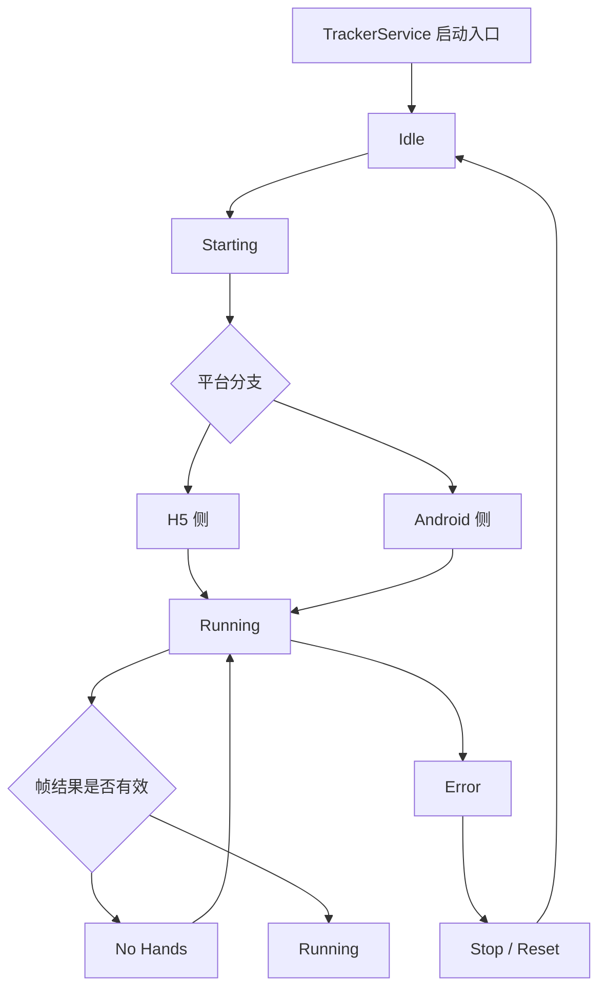

# cameratracking

`cameratracking` 是一个基于 `uni-app x + UTS + MediaPipe` 的双手追踪项目。

本说明文档由 AI 协助整理生成，并结合仓库中的代码注释、目录结构以及本地自定义基座同步脚本进行编写。

## 目录

- [项目简介](#项目简介)
- [技术栈与版本要求](#技术栈与版本要求)
- [目录结构说明](#目录结构说明)
- [运行原理说明](#运行原理说明)
- [开发与运行](#开发与运行)
- [Android 自定义基座](#android-自定义基座)
- [本地打包与同步](#本地打包与同步)
- [常见问题](#常见问题)
- [参考链接](#参考链接)

## 项目简介

本项目用于实现双手追踪能力，支持 H5 预览与 Android 原生链路。页面层将 marker、状态面板和调试信息分层组织，避免业务逻辑与展示逻辑混杂。

## 技术栈与版本要求

- HBuilderX：`5.05`
- uni-app x：`0.7.118`
- uni-app：`3.0.0-4070620250821001`
- Vue：`3.4.21`
- Android Studio：`2025.3.2`
- Android Studio Build：`253.30387.90.2532.14935130`
- Android Studio 自带 JBR / JRE：`21.0.9`
- Gradle Wrapper：`8.14.3`
- Android Gradle Plugin：`8.12.0`
- Kotlin：`2.2.0`
- 最低 Android SDK：`24`

建议使用 Android Studio 自带的 JBR，不必额外安装外部 JDK。

## 目录结构说明

```text
├─pages/index              // 页面入口与渲染层
├─services/tracker         // 追踪服务与平台适配器
├─shared/tracking          // 共享模型、状态机和归一化逻辑
├─uni_modules/hand-tracker // Android UTS 原生插件
├─static/mediapipe         // wasm 与模型文件
├─unpackage/resources      // HBuilderX 导出的 Android 资源
└─scripts                  // 静态资源同步脚本
```

### 关键文件

- [`pages/index/index.uvue`](pages/index/index.uvue) - 页面 UI
- [`pages/index/index.uts`](pages/index/index.uts) - 页面编排
- [`services/tracker/tracker-service.uts`](services/tracker/tracker-service.uts) - 统一调度
- [`shared/tracking/presenter.uts`](shared/tracking/presenter.uts) - 状态组织
- [`shared/tracking/normalizer.uts`](shared/tracking/normalizer.uts) - 坐标归一化
- [`uni_modules/hand-tracker/utssdk/app-android/index.uts`](uni_modules/hand-tracker/utssdk/app-android/index.uts) - Android 插件入口

## 运行原理说明

### 状态机树状结构



### 传递链路

`页面生命周期` -> [`pages/index/index.uts`](pages/index/index.uts) -> [`services/tracker/tracker-service.uts`](services/tracker/tracker-service.uts) -> 平台适配器 -> [`shared/tracking/presenter.uts`](shared/tracking/presenter.uts) -> 页面渲染

### 质心算法

项目中的“手部点位”并不直接使用完整 landmarks，而是先计算质心，再折算到页面坐标。

- Android 侧优先选取一组稳定关节点：`0 / 1 / 5 / 9 / 13 / 17`
- 如果这组点不可用，则退回到全量 landmarks
- 质心坐标使用所有有效点的算术平均值
- `size` 使用手部包围盒的最大边长，作为页面缩放参考值

简化表达如下：

`centroidX = sum(x) / count`

`centroidY = sum(y) / count`

`size = max(maxX - minX, maxY - minY)`

相关实现可参考：

- [`uni_modules/hand-tracker/utssdk/app-android/MediaPipeHandDetector.kt`](uni_modules/hand-tracker/utssdk/app-android/MediaPipeHandDetector.kt)
- [`services/tracker/web/h5-hand-detector-adapter.js`](services/tracker/web/h5-hand-detector-adapter.js)
- [`shared/tracking/normalizer.uts`](shared/tracking/normalizer.uts)

### 平台适配

- H5：浏览器申请摄像头，MediaPipe Web 处理视频帧。
- Android：原生基座承载 `native-view`，CameraX 采集，UTS 插件负责 MediaPipe 检测。

### 阅读顺序

1. 先看 [`pages/index/index.uts`](pages/index/index.uts) 和 [`pages/index/index.uvue`](pages/index/index.uvue)。
2. 再看 [`services/tracker/tracker-service.uts`](services/tracker/tracker-service.uts) 与 [`shared/tracking/presenter.uts`](shared/tracking/presenter.uts)。

## 开发与运行

### HBuilderX 侧

1. 使用 HBuilderX 打开项目根目录。
2. 执行 `npm install`。
3. 运行 H5 预览，检查 `static/mediapipe/wasm` 与 `static/mediapipe/models/hand_landmarker.task` 是否存在。

### Android 侧

1. 使用 Android Studio 打开自定义基座工程。
2. 确认 JBR、Gradle、AGP、Kotlin 版本一致。
3. 同步 HBuilderX 导出的资源与 UTS 插件产物。
4. 重新编译生成 `app-debug.apk`。

## Android 自定义基座

Android 侧依赖 CameraX、MediaPipe 原生检测、UTS 插件和 `native-view`，因此必须使用自定义基座。

关键模块如下：

- `uniappx` - 承载导出的页面资源
- `hand_tracker` - 承载 Android UTS 插件实现
- `app` - 主工程壳

版本不一致时，常见问题包括资源找不到、插件编译失败和运行异常。

## 本地打包与同步

### 导出路径

- `unpackage/resources/app-android/__UNI__182A7FD/`

### 同步目标

- `unpackage/resources/app-android/__UNI__182A7FD/www/` -> `uniappx/src/main/assets/apps/__UNI__182A7FD/www/`
- `unpackage/resources/app-android/uni_modules/hand-tracker/utssdk/app-android/src/` -> `hand_tracker/src/main/java/uts/sdk/modules/handTracker/`
- `unpackage/resources/app-android/uniappx/app-android/src/` -> `uniappx/src/main/java/`

### 同步原则

- 先清理旧产物，再复制新产物。
- 不直接修改生成目录中的 Kotlin 文件。
- 同步后必须重新编译 Android Studio 工程。
- 最终 APK 建议统一命名为 `android_debug.apk`，并回拷到 `unpackage/debug`。

## 常见问题

- 无相机画面：检查权限和预览宿主。
- H5 正常、Android 异常：检查 `hand_tracker` 与 `uniappx` 的同步结果。
- 模型缺失：检查 `static/mediapipe/models/hand_landmarker.task`。
- wasm 缺失：检查 `static/mediapipe/wasm`。
- 编译失败：检查 Android Studio、Gradle、AGP、Kotlin、JBR 版本。

## 参考链接

- [uni-app x 原生联调 - Android](https://doc.dcloud.net.cn/uni-app-x/native/debug/android.html)
- [uni-app x 原生SDK Android版](https://doc.dcloud.net.cn/uni-app-x/native/use/android.html)
- [uni-app x Android原生SDK下载](https://doc.dcloud.net.cn/uni-app-x/native/download/android.html)
- [UTS 插件介绍](https://doc.dcloud.net.cn/uni-app-x/plugin/uts-plugin.html)
- [UTS 插件 - 标准模式组件开发](https://doc.dcloud.net.cn/uni-app-x/plugin/uts-component-vue.html)
- [Android 审查界面元素](https://doc.dcloud.net.cn/uni-app-x/debug/android-inspector.html)
- [Android Studio 官方文档](https://developer.android.com/studio)
- [Gradle 官方文档](https://docs.gradle.org/current/userguide/userguide.html)
